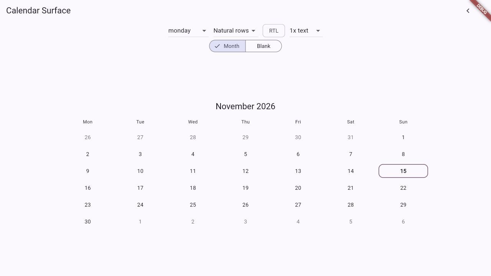
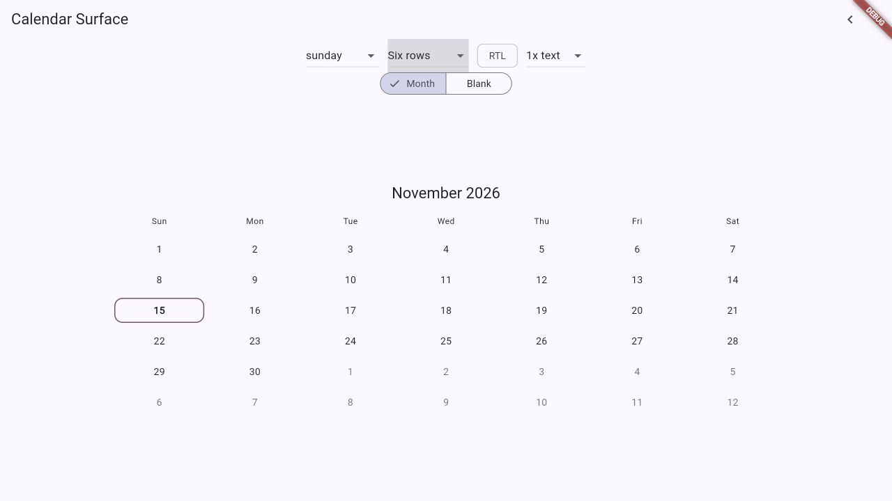
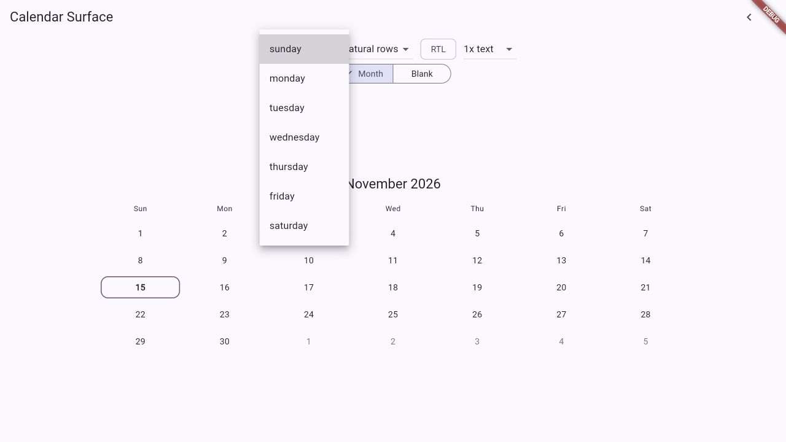
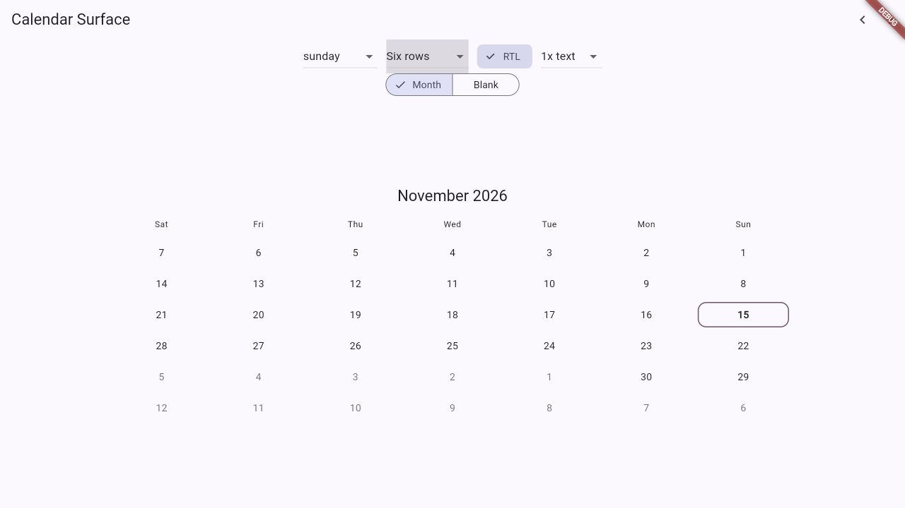
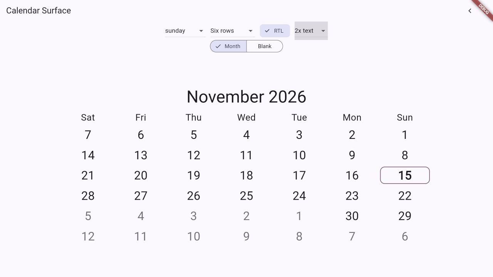
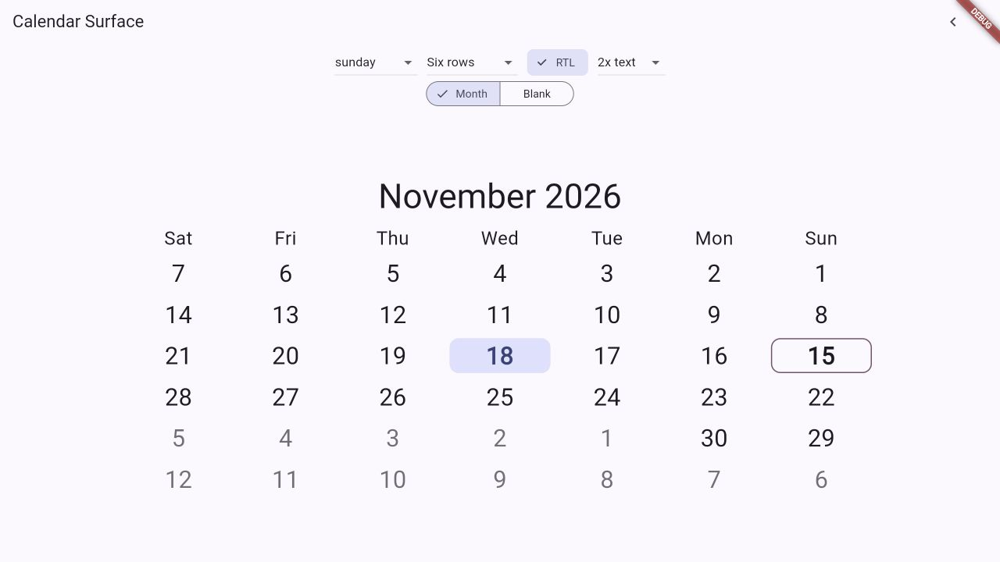
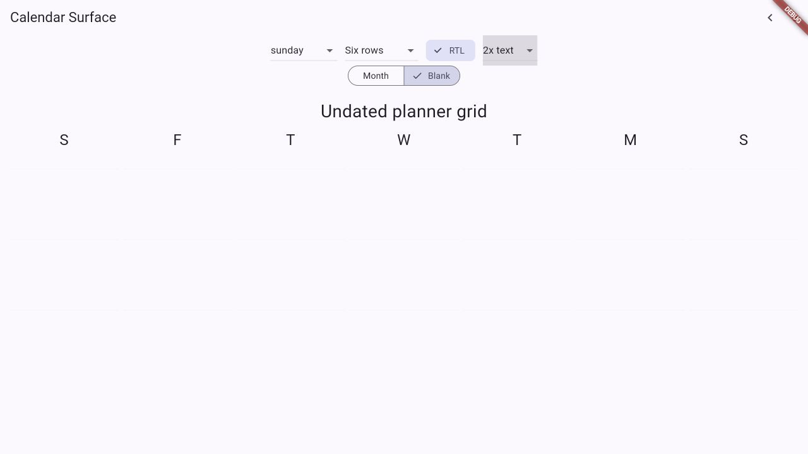
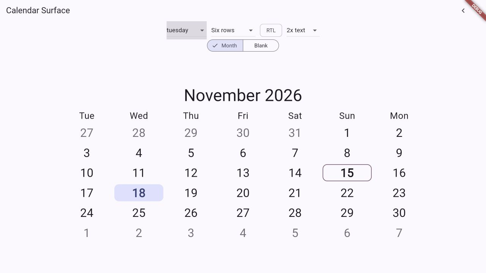

# BetaCalendars Calendar Surface

Accessible, adaptive Flutter month-calendar surfaces with date-only models,
responsive weekday labels, large-text layouts, RTL mirroring, keyboard
navigation, and undated planning grids.

Calendar Surface is a presentation layer. It does not store appointments,
implement recurrence rules, synchronize calendars, or convert time zones.

## Features

- Immutable Gregorian month and grid models, independent of widgets.
- Sunday through Saturday week starts, natural rows, or a fixed 42-cell grid.
- Explicit adjacent-day policies: show, hide, or structural placeholder.
- Material localization for month names and full date semantics; customizable
  weekday labels for host localization systems.
- Responsive layout based on actual constraints and text scale.
- Selected, focused, and caller-supplied today states with theme overrides.
- Arrow-key, Home/End, Page Up/Page Down, Enter, and Space interaction.
- RTL visual mirroring while date data stays chronological.
- A date-free blank grid for planners and custom schedule canvases.
- Flutter SDK only at runtime. No storage, network calls, analytics, or telemetry.

## Quick start

After the first version is published, add the package with:

```sh
flutter pub add betacalendars_calendar_surface
```

Then compose a month surface with caller-owned state:

```dart
AdaptiveCalendarSurface(
  month: CivilMonth(2027, 1),
  weekStartsOn: WeekStart.monday,
  selectedDate: selectedDate,
  onDayActivated: (date) => setState(() => selectedDate = date),
)
```

Date values in callbacks are UTC-midnight carriers for civil year/month/day
fields. They do not represent an instant or perform time-zone conversion.

## Responsive layout and text scaling

`AdaptiveCalendarSurface` resolves weekday-label density from the widget's
available width and the host `TextScaler`. It never replaces or clamps the
user's text scale. Interactive rows retain a 44 logical-pixel preferred target
height; very narrow parents can still make horizontal targets smaller, so place
the calendar in a sufficiently wide constraint when touch targets matter.
Wide surfaces can set `maxCalendarWidth` to keep the grid readable.

The default weekday headings use Flutter's localized narrow weekday strings.
Provide `weekdayLabelBuilder` to use full or abbreviated localized labels from
your app's localization system. The callback receives a Sunday-first index and
the resolved density.

## Accessibility and keyboard use

Each real date exposes a localized full-date label from
`MaterialLocalizations.formatFullDate`. Hidden adjacent dates become empty
structural slots and are not exposed as dates. Read-only surfaces do not mark
each day as a disabled button. Supply `today` to announce and draw a stable
today state; the package does not read the system clock.

When `onDayActivated` is present, date cells can be reached by focus and support
arrow keys, Home/End, Page Up/Page Down, Enter, and Space. In RTL, left/right
movement follows the mirrored visual direction while the model remains in
chronological order. Update a controlled `focusedDate` from
`onFocusedDateChanged` when the parent owns focus state.

These behaviors are implementation support, not a claim of full WCAG
conformance. Verify contrast, target sizes, and assistive-technology behavior in
the host application's actual constraints and themes.

## Week starts and adjacent days

```dart
final model = CalendarMonthModel(
  month: CivilMonth(2027, 1),
  weekStartsOn: WeekStart.sunday,
  gridMode: MonthGridMode.fixedSixWeeks,
  adjacentDays: AdjacentDayMode.show,
);
```

`natural` grids use four, five, or six rows as needed. `fixedSixWeeks` always
contains 42 structural cells. `AdjacentDayMode.hide` preserves grid geometry
but removes adjacent dates from visual and semantic output;
`placeholder` provides date-free outside slots; `show` includes actual adjacent
civil dates.

## Custom day visuals and themes

`CalendarSurface.dayBuilder` receives the cell and its selected, focused,
today, and interaction state. The surface owns focus, gestures, and semantics;
return visual content rather than a second button. Add a
`CalendarSurfaceTheme` to `ThemeData.extensions` to tune state colors, borders,
radius, and padding. Defaults come from the active Material `ColorScheme`, so
light, dark, and high-contrast themes remain host-controlled.

## Screenshots

| Adaptive month | Fixed six rows |
| --- | --- |
|  |  |

| Sunday week start | Right-to-left |
| --- | --- |
|  |  |

| Large text | Selected date |
| --- | --- |
|  |  |

| Blank planner grid | Tuesday week start |
| --- | --- |
|  |  |

## Blank calendars

`BlankCalendarSurface(rows: 6)` builds an undated grid. Its
`BlankCalendarModel` contains only row and column positions—no hidden January,
invented `DateTime`, or fabricated day numbers. Supply Sunday-first localized
weekday labels or omit the weekday header for a pure planning canvas.

For printable undated layout context, see the
[Beta Calendars blank-calendar reference](https://www.betacalendars.com/blank-calendar).

## Visual reference fixtures

The example and deterministic model tests use a four-month sequence across a
year boundary. These pages are human-facing references; package layout data is
calculated locally and is never fetched from the website.

- [November calendar reference](https://www.betacalendars.com/november-calendar.html)
- [December calendar reference](https://www.betacalendars.com/december-calendar.html)
- [January calendar reference](https://www.betacalendars.com/january-calendar.html)
- [February calendar reference](https://www.betacalendars.com/february-calendar.html)

## Platforms and WebAssembly

The library uses Flutter framework widgets and has no platform-specific imports
or runtime dependencies. It is intended for Android, iOS, Web, Windows, macOS,
and Linux. Browser Wasm readiness is not claimed until the example's current
Flutter `--wasm` build is verified in CI.

The minimum is Dart 3.8 and Flutter 3.35. It supports current analyzer/lint
tooling and the stable text-scaling APIs while keeping the package below the
current stable toolchain. CI checks the current stable toolchain too.

## Example and development

Run the demo from this package directory:

```sh
cd example
flutter pub get
flutter run -d chrome
```

Run checks from the package root:

```sh
dart format --output=none --set-exit-if-changed .
flutter analyze
flutter test
dart doc
flutter pub publish --dry-run
```

See [architecture notes](doc/architecture.md),
[accessibility notes](doc/accessibility.md), and
[reference-month fixtures](doc/reference-months.md).

## Project

Calendar Surface is maintained as part of the
[Beta Calendars](https://www.betacalendars.com/) calendar-engineering project.

## License

MIT. See [LICENSE](LICENSE).
